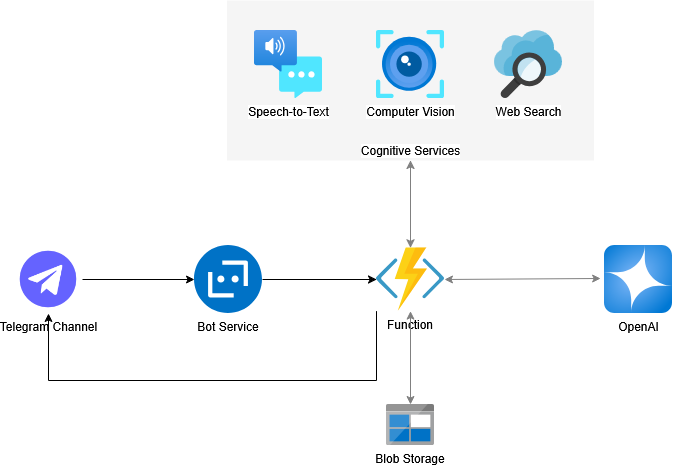

# Multimodal Travel Assistant Chatbot

This project is a **multimodal travel assistant chatbot** deployed on **Telegram**, built using various **Azure services**. It can process text, voice, and images to provide intelligent travel assistance using **OpenAI's GPT-3.5 (model `gpt-3o`)**, web search, and vision APIs — all orchestrated through a serverless Python backend.

* [Demo Video](./MMTravelAssistant-Demo.mp4)
* [Chatbot Link](https://telegram.me/SIG788_MM_Travel_Assistant_Bot)

## Key Features

* **Text & voice-based conversation** via Telegram
* **Image input** processing using Azure **Computer Vision**
* **Speech-to-text** via Azure **Speech Services**
* **Web search** for live travel updates
* **Contextual responses** powered by Azure **OpenAI (`o3-mini`)**
* **Blob Storage** for chat history and context persistence
* **Serverless backend** with Azure **Functions** using `azure-sdk`

## Architecture

| Component            | Service Used                  |
| -------------------- | ------------------------------|
| Chatbot Frontend     | Azure Bot Service - Telegram  |
| Backend Logic        | Azure Functions (Python)      |
| LLM Integration      | Azure OpenAI (`o3-mini`)      |
| Audio Transcription  | Azure Speech-to-Text          |
| Image Analysis       | Azure Computer Vision         |
| Search Capability    | SerpAPI                       |
| Chat History Storage | Azure Blob Storage            |

## How It Works

1. User sends a message (text, voice, or image) via **Telegram**.
2. An **Azure Function** is triggered through **Azure Bot Service** and handles:
   * Speech-to-text conversion (for voice)
   * Image analysis via Computer Vision to generate text description
   * Query enhancement using web search
   * LLM completion via OpenAI’s `o3-mini` model
3. The response is returned to the user on Telegram.
